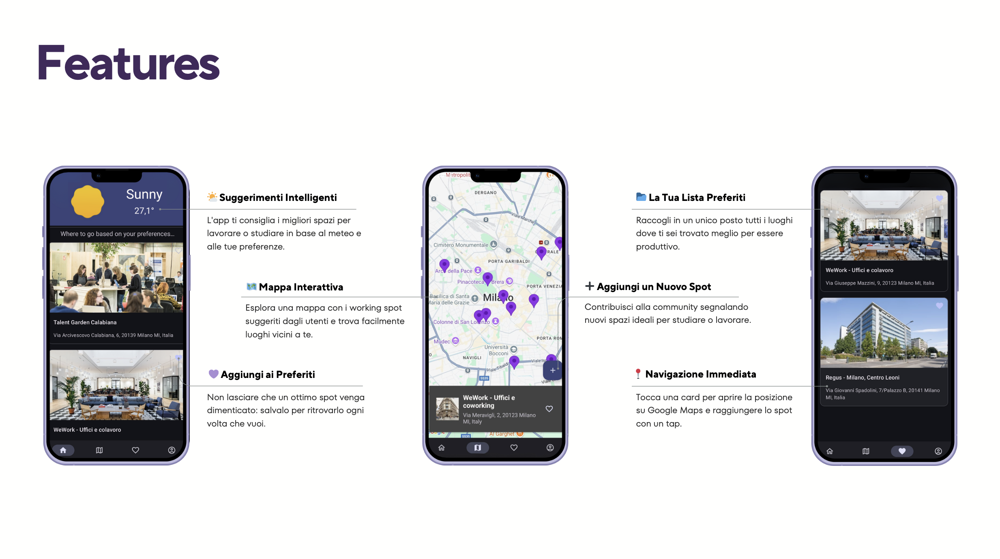
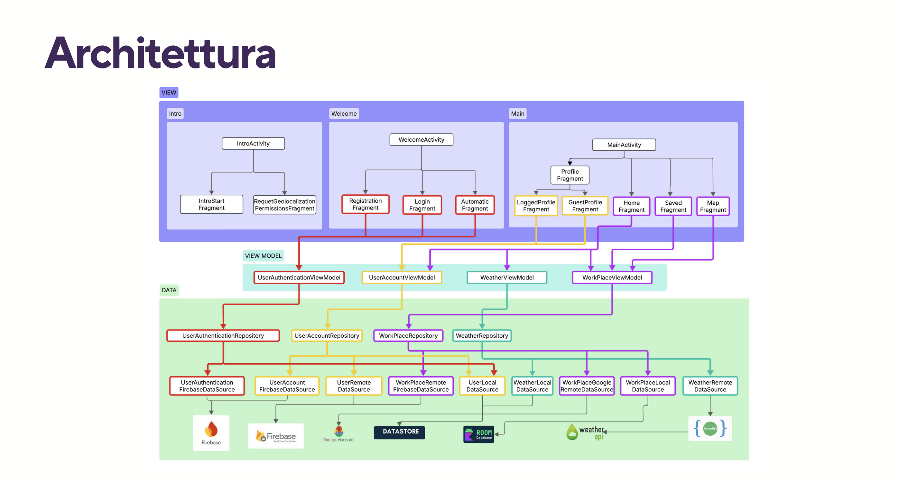

# WorkingSpot
An app for finding Co-Working spot. Made for the course "Mobile Devices Programming" at the University of Milan-Bicocca

## 📖 Presentation

### 🎯 **WorkingSpot - Find your ideal space to study or work**

> A community that helps you discover and share the best places to be productive, wherever you are.

### 👥 **Development Team**

- **Youssef Bimezzagh** - 894506
- **Andrea Consonni** - 900116  
- **Samuele Carbone** - 899661
- **Matteo Cervini** - 902225

### ✨ **Main Features**

- 🌤️ **Smart Suggestions** - The app recommends the best spaces to work or study based on weather and your preferences
- 📂 **Your Favorites List** - Collect all the places where you've found yourself most productive in one place
- 🗺️ **Interactive Map** - Explore a map with working spots suggested by users and easily find places near you
- ➕ **Add a New Spot** - Contribute to the community by reporting new ideal spaces for studying or working
- 💜 **Add to Favorites** - Don't let a great spot be forgotten: save it to find it again whenever you want
- 📍 **Immediate Navigation** - Tap a card to open the location on Google Maps and reach the spot with one tap

---

## 🚀 **Getting Started**

1. **Registration/Login**: Create an account or sign in with your credentials
2. **Permissions**: Grant geolocation permissions to find nearby spots
3. **Explore**: Discover working spots recommended by the community
4. **Contribute**: Add new spots and share your experience
5. **Organize**: Save your favorites for quick access

---

## 🔧 **Technologies Used**

- **Frontend**: Android Native (Java)
- **Backend**: Firebase
- **Database**: Room Database (local) + Firebase Firestore
- **Maps**: Google Maps API
- **Weather**: Weather API
- **Authentication**: Firebase Authentication

---

## 📄 **Complete Documentation**

For detailed information about the implementation, consult the [Complete Documentation](Documentazione/Documentazione.pdf).

---

*WorkingSpot - Transform every place into a productive space* 🚀

